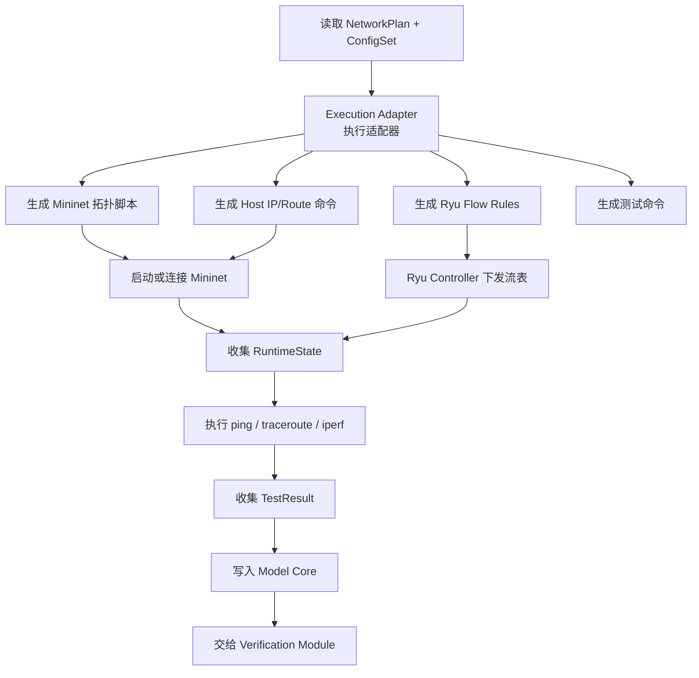
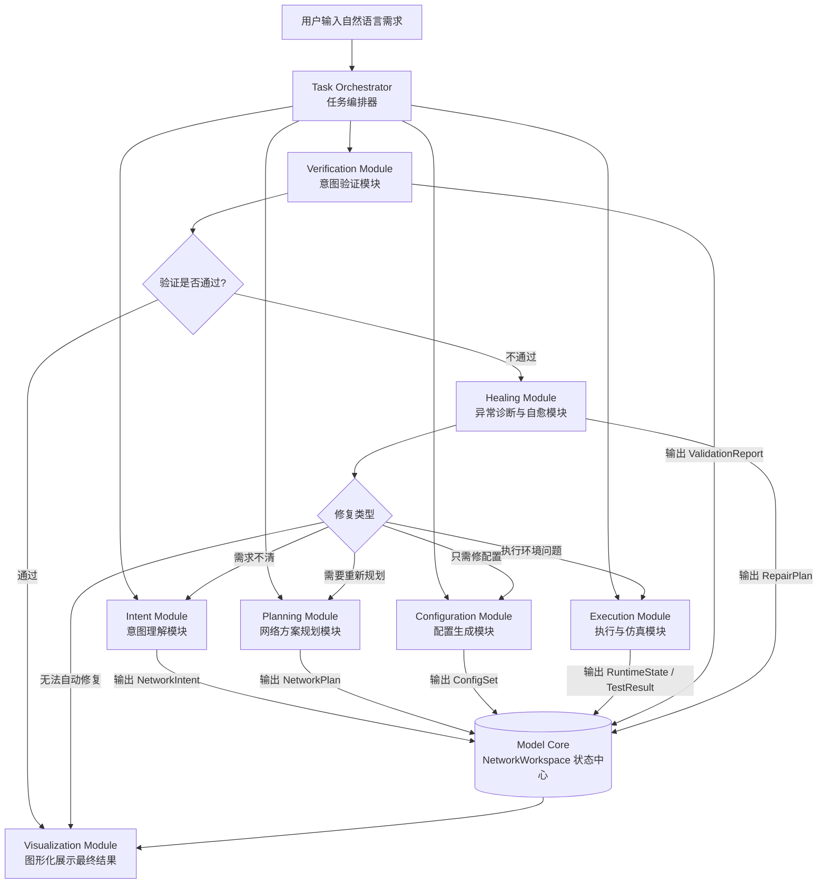

# 系统模块设计
# 开发约束

1. 本文档用于指导项目 Demo 阶段开发，优先实现可运行的端到端流程。
2. 各模块先以 Java DTO、Service 接口、假数据实现为主，不要求一开始接入真实大模型、真实 RAG、真实 Mininet。
3. 所有模块输出必须保存到 Model Core / NetworkWorkspace 中。
4. Intent Module 只输出业务意图，不允许生成具体设备、接口、VLAN、IP。
5. Planning Module 输出 NetworkPlan，允许生成设备、主机、链路、VLAN、IP、路由、安全策略，但不生成具体 CLI 命令。
6. Configuration Module 输出 ConfigSet，负责生成设备配置命令，并按 deviceConfigs 和 commandBlocks 结构化返回。
7. Execute Module 不直接执行 Huawei CLI，而是通过 Execution Adapter 将 NetworkPlan + ConfigSet 转换为 Mininet / Ryu 可执行内容。
8. Verification Module 根据 NetworkIntent、NetworkPlan、RuntimeState、TestResult 判断意图是否达成，输出 ValidationReport。
9. Healing Module 第一阶段可以用假数据或规则模拟，不要求完整自愈闭环。
10. 所有 DTO 字段参考本文档 JSON 示例，但是不必完全一致，可以加入你自动的想法。
11. 注意：Mininet/Ryu 不能直接执行华为 CLI 命令，因此 Execute Module 不会逐行执行 ConfigSet 中的设备命令，而是根据 NetworkPlan 和 ConfigSet 中的配置意图，转换为 Mininet 拓扑脚本、Linux 主机命令、OVS/Ryu 流表规则和测试命令。

# 意图解析模块（Intent Module)
## 模块描述

负责接收用户输入的自然语言网络需求，将其解析为**结构化的 NetworkIntent**。该模块重点提取业务目标、连通性要求、隔离策略、协议偏好、性能约束和验证目标等。
对于用户明确指定的设备数量、协议类型或拓扑结构，系统将其作为约束条件保留；对于用户未明确说明的部分，模块不直接做最终网络设计，而是交由网络方案规划模块进一步推导。
只输出业务意图，不输出具体网络设计。

## 模块输入输出
### 原始用户输入

```text
{
  "rawText": "构建一个办公区和访客区隔离的网络，两个区域都能访问互联网，访客区不能访问服务器"
}
```
### 模块输出字段（暂定）

- taskId：一次完整任务的 ID
- intentVersion：某一次意图解析结果的 ID，表示当前任务下第几版意图解析结果。
- semanticIntentGraph：因为网络意图本质上可以理解成一个“意图图”：节点：办公区、访客区、服务器区、公网。边：办公区可以访问服务器区、访客区不能访问服务器区
- 缺失信息 assumptions：如果用户描述不完整，可以让系统标记缺失信息。这个字段很适合前端展示：
  ```
  系统发现你没有指定 IP 地址规划，将默认自动规划。
  系统发现你没有指定设备厂商，将默认生成华为风格配置。
  ```
### 模块输出示例
```json
{
  "taskId": "task-10001",
  "intentVersion": 1,
  "rawText": "构建一个办公区和访客区隔离的网络，两个区域都能访问互联网，办公区可以访问服务器，访客区不能访问服务器，采用 OSPF。",
  "semanticIntentGraph": {
    "nodes": [
      {
        "id": "office",
        "name": "办公区",
        "type": "ZONE",
        "description": "企业内部办公用户所在区域"
      },
      {
        "id": "guest",
        "name": "访客区",
        "type": "ZONE",
        "description": "访客用户所在区域"
      },
      {
        "id": "server",
        "name": "服务器区",
        "type": "ZONE",
        "description": "内部服务器所在区域"
      },
      {
        "id": "internet",
        "name": "公网",
        "type": "EXTERNAL_NETWORK",
        "description": "外部互联网"
      }
    ],
    "relations": [
      {
        "id": "rel-001",
        "type": "ACCESS",
        "source": "office",
        "target": "server",
        "action": "ALLOW",
        "service": "ANY",
        "description": "办公区可以访问服务器区",
        "explicit": true
      },
      {
        "id": "rel-002",
        "type": "ACCESS",
        "source": "guest",
        "target": "server",
        "action": "DENY",
        "service": "ANY",
        "description": "访客区不能访问服务器区",
        "explicit": true
      },
      {
        "id": "rel-003",
        "type": "ACCESS",
        "source": "office",
        "target": "internet",
        "action": "ALLOW",
        "service": "ANY",
        "description": "办公区可以访问公网",
        "explicit": true
      },
      {
        "id": "rel-004",
        "type": "ACCESS",
        "source": "guest",
        "target": "internet",
        "action": "ALLOW",
        "service": "ANY",
        "description": "访客区可以访问公网",
        "explicit": true
      },
      {
        "id": "rel-005",
        "type": "ISOLATION",
        "source": "office",
        "target": "guest",
        "action": "DENY",
        "service": "ANY",
        "description": "办公区与访客区需要相互隔离",
        "explicit": true
      }
    ]
  },
  "assumptions": [
    {
      "field": "deviceTopology",
      "value": "AUTO_PLAN",
      "reason": "用户未指定具体设备数量和连接方式，后续由 Planning Module 自动规划拓扑"
    },
    {
      "field": "addressPlan",
      "value": "AUTO_PLAN",
      "reason": "用户未指定 IP 地址规划，后续由 Planning Module 自动分配网段和网关"
    },
    {
      "field": "vendor",
      "value": "Huawei",
      "reason": "用户未指定设备厂商，系统默认使用 Huawei 风格配置命令"
    }
  ],
  "status": "PARSED"
}
```

# 网络方案规划模块(Planning Module)

## 模块描述

负责根据 NetworkIntent 生成可执行的网络设计方案。该模块结合用户目标、网络设计规则和实验环境约束，完成设备选型、拓扑结构设计、链路关系规划、IP 地址规划、VLAN 划分、路由策略和访问控制策略设计，输出 **NetworkPlan**。该模块可以生成多个候选方案，并给出方案选择理由。输出网络方案，不输出具体设备命令。
## 模块输入输出
### 模型输出字段（暂定）

- taskId、intentVersion、planVersion：这个是为了追踪版本。taskId：这次完整任务。intentVersion：基于第几版意图解析结果。planVersion：这是第几版网络规划方案
- planSummary：规划结果的简要说明，给前端展示。
- selectedArchitecture：表示系统选择了哪种网络实现架构。常见类型可以有：
  ```text
  L2_SWITCHING_ONLY          纯二层交换
  ROUTER_ON_A_STICK          单臂路由
  L3_SWITCH_CORE             三层交换核心
  STATIC_ROUTING             静态路由
  OSPF_ROUTING               OSPF 路由
  SDN_OPENFLOW               SDN / OpenFlow
  HYBRID                     混合方案
  ```
- topology：这是规划模块最核心的数据。它描述真正的网络拓扑。
- zone：这个字段把 Intent Module 里的业务对象映射成网络区域。后面 VLAN、IP、ACL 都可以基于 zone 来做。
- addressPlan：IP 地址规划。
### 模块输出示例

```json
{
  "taskId": "task-10001",
  "intentVersion": 1,
  "planVersion": 1,
  "planSummary": "系统规划一个基于 VLAN 隔离、单路由器三层转发、ACL 访问控制和 OSPF 路由的企业接入网络方案。",
  "selectedArchitecture": {
    "type": "ROUTER_ON_A_STICK",
    "reason": "该方案适合轻量实验场景，可以用较少设备实现多区域隔离、三层互通和访问控制。"
  },
   "topology": {
    "nodes": [
      {
        "id": "R1",
        "name": "出口路由器",
        "nodeType": "DEVICE",
        "deviceType": "ROUTER",
        "role": "GATEWAY",
        "vendor": "Huawei"
      },
      {
        "id": "SW1",
        "name": "接入交换机1",
        "nodeType": "DEVICE",
        "deviceType": "SWITCH",
        "role": "ACCESS",
        "vendor": "Huawei"
      },
      {
        "id": "SW2",
        "name": "接入交换机2",
        "nodeType": "DEVICE",
        "deviceType": "SWITCH",
        "role": "ACCESS",
        "vendor": "Huawei"
      },
      {
        "id": "office-pc-1",
        "name": "办公区主机",
        "nodeType": "HOST",
        "hostType": "PC",
        "zoneId": "office"
      },
      {
        "id": "guest-pc-1",
        "name": "访客区主机",
        "nodeType": "HOST",
        "hostType": "PC",
        "zoneId": "guest"
      },
      {
        "id": "server-1",
        "name": "服务器",
        "nodeType": "HOST",
        "hostType": "SERVER",
        "zoneId": "server"
      },
      {
        "id": "internet",
        "name": "公网",
        "nodeType": "EXTERNAL_NETWORK",
        "zoneId": "internet"
      }
    ],
    "links": [
      {
        "id": "link-001",
        "sourceNode": "R1",
        "sourceInterface": "GE0/0/0",
        "targetNode": "SW1",
        "targetInterface": "GE0/0/1",
        "linkType": "TRUNK"
      },
      {
        "id": "link-002",
        "sourceNode": "SW1",
        "sourceInterface": "GE0/0/2",
        "targetNode": "SW2",
        "targetInterface": "GE0/0/1",
        "linkType": "TRUNK"
      },
      {
        "id": "link-003",
        "sourceNode": "office-pc-1",
        "sourceInterface": "eth0",
        "targetNode": "SW1",
        "targetInterface": "GE0/0/10",
        "linkType": "ACCESS"
      },
      {
        "id": "link-004",
        "sourceNode": "guest-pc-1",
        "sourceInterface": "eth0",
        "targetNode": "SW1",
        "targetInterface": "GE0/0/11",
        "linkType": "ACCESS"
      },
      {
        "id": "link-005",
        "sourceNode": "server-1",
        "sourceInterface": "eth0",
        "targetNode": "SW2",
        "targetInterface": "GE0/0/10",
        "linkType": "ACCESS"
      },
      {
        "id": "link-006",
        "sourceNode": "R1",
        "sourceInterface": "GE0/0/1",
        "targetNode": "internet",
        "targetInterface": "wan0",
        "linkType": "WAN"
      }
    ]
  },
  "zones": [
    {
      "id": "office",
      "name": "办公区",
      "mappedFromIntentNode": "office",
      "zoneType": "USER_ZONE"
    },
    {
      "id": "guest",
      "name": "访客区",
      "mappedFromIntentNode": "guest",
      "zoneType": "USER_ZONE"
    },
    {
      "id": "server",
      "name": "服务器区",
      "mappedFromIntentNode": "server",
      "zoneType": "SERVER_ZONE"
    },
    {
      "id": "internet",
      "name": "公网",
      "mappedFromIntentNode": "internet",
      "zoneType": "EXTERNAL_NETWORK"
    }
  ],
  "addressPlan": [
    {
      "zoneId": "office",
      "subnet": "192.168.10.0/24",
      "gateway": "192.168.10.1"
    },
    {
      "zoneId": "guest",
      "subnet": "192.168.20.0/24",
      "gateway": "192.168.20.1"
    },
    {
      "zoneId": "server",
      "subnet": "192.168.30.0/24",
      "gateway": "192.168.30.1"
    }
  ],
  "vlanPlan": [
    {
      "vlanId": 10,
      "name": "OFFICE",
      "zoneId": "office",
      "accessPorts": [
        {
          "deviceId": "SW1",
          "interface": "GE0/0/10"
        }
      ]
    },
    {
      "vlanId": 20,
      "name": "GUEST",
      "zoneId": "guest",
      "accessPorts": [
        {
          "deviceId": "SW1",
          "interface": "GE0/0/11"
        }
      ]
    },
    {
      "vlanId": 30,
      "name": "SERVER",
      "zoneId": "server",
      "accessPorts": [
        {
          "deviceId": "SW2",
          "interface": "GE0/0/10"
        }
      ]
    }
  ],
 "routingPlan": {
    "protocol": "OSPF",
    "area": "0.0.0.0",
    "routers": [
      {
        "deviceId": "R1",
        "routerId": "1.1.1.1",
        "advertisedNetworks": [
          "192.168.10.0/24",
          "192.168.20.0/24",
          "192.168.30.0/24"
        ]
      }
    ],
    "defaultRoute": {
      "enabled": true,
      "nextHop": "ISP"
    }
  },
  "securityPolicyPlan": [
    {
      "id": "policy-001",
      "name": "deny_guest_to_server",
      "sourceZone": "guest",
      "targetZone": "server",
      "action": "DENY",
      "service": "ANY",
      "enforcementPoint": {
        "deviceId": "R1",
        "interface": "GE0/0/0.20",
        "direction": "INBOUND"
      },
      "basedOnIntentRelation": "rel-002"
    },
    {
      "id": "policy-002",
      "name": "deny_office_guest_access",
      "sourceZone": "office",
      "targetZone": "guest",
      "action": "DENY",
      "service": "ANY",
      "enforcementPoint": {
        "deviceId": "R1",
        "interface": "GE0/0/0.10",
        "direction": "INBOUND"
      },
      "basedOnIntentRelation": "rel-005"
    }
  ],
  "natPlan": {
    "enabled": true,
    
    "insideZones": ["office", "guest"],
    "outsideInterface": {
      "deviceId": "R1",
      "interface": "GE0/0/1"
    },
    "description": "办公区和访客区通过出口路由器访问公网。"
  },
  "targetEnvironment": {
	  "vendor": "Huawei",
	  "configStyle": "CLI",
	  "simulationTarget": "MININET_RYU"
	},
  "status": "PLANNED"
}
```

# 统一网络模型与状态管理模块（Model-core Module）

## 模块描述

统一网络模型与状态管理模块不负责独立生成网络方案，而是负责保存、转换、版本管理和对比系统中的意图模型、目标网络模型、配置模型、运行状态和验证结果，是整个闭环流程的数据底座。
应该保存：
```
1. 当前任务状态
2. 当前使用的是哪一版 Intent / Plan / Config / Validation
3. 各阶段产物的引用或快照
4. 意图、规划、配置、验证之间的映射关系
5. 运行时状态，比如仿真环境、设备状态、链路状态
6. Agent 执行过程和状态变更记录
7. 自愈修复历史
```

# 配置生成模块（Configuration Module）

## 模块描述

负责将 **NetworkPlan** 转换为具体设备配置命令。该模块结合 RAG 检索、配置模板和设备命令知识库，为不同设备生成对应配置，并输出 **ConfigSet**。配置结果按设备分类展示，同时保留配置解释和回滚信息，方便后续验证和自愈修复。

## 模型输入输出

### 模型输出字段

- taskId：属于哪个任务
- planVersion：基于第几版网络规划生成
- configVersion：这是第几版配置。如果后面自愈修改配置，可以生成：`configVersion = 2`
- generationSummary：配置生成摘要，给前端展示。
- deviceConfigs：这是最核心的字段。这里的 `configText` 是给用户看的完整配置。`commandBlocks` 是给系统用的结构化配置块。
- commandBlocks：不要只返回完整命令文本，最好拆成多个块。这样后面自愈时就很好定位。
  如果你只返回：
  ```
  {  "R1": "一大段命令"}
  ```
  后面会很难做这些事：
  ```
  前端展示每段配置的作用
  验证失败后定位是哪段配置有问题
  自愈时只修改某个配置块
  回滚某个配置块
  追踪这段命令来自哪条用户意图
  ```
- endpointConfigs:因为拓扑里有主机，这些主机虽然不是路由器交换机，但在 Mininet / Linux 仿真里也需要配置 IP、网关。

### 模型输出示例

```json
{
  "taskId": "task-10001",
  "planVersion": 1,
  "configVersion": 1,
  "targetEnvironment": {
    "vendor": "Huawei",
    "configStyle": "CLI",
    "simulationTarget": "MININET_RYU"
  },
  "generationSummary": "已为 R1、SW1、SW2 生成 VLAN、接口、OSPF、ACL、NAT 以及主机地址相关配置。",
  "deviceConfigs": [
    {
      "deviceId": "R1",
      "deviceName": "出口路由器",
      "deviceType": "ROUTER",
      "vendor": "Huawei",
      "configText": "interface GigabitEthernet0/0/0.10\n dot1q termination vid 10\n ip address 192.168.10.1 255.255.255.0\n arp broadcast enable\n#\ninterface GigabitEthernet0/0/0.20\n dot1q termination vid 20\n ip address 192.168.20.1 255.255.255.0\n arp broadcast enable\n#\ninterface GigabitEthernet0/0/0.30\n dot1q termination vid 30\n ip address 192.168.30.1 255.255.255.0\n arp broadcast enable\n#\nacl number 3000\n rule 5 deny ip source 192.168.20.0 0.0.0.255 destination 192.168.30.0 0.0.0.255\n rule 10 permit ip\n#\ninterface GigabitEthernet0/0/0.20\n traffic-filter inbound acl 3000\n#\nospf 1 router-id 1.1.1.1\n area 0.0.0.0\n  network 192.168.10.0 0.0.0.255\n  network 192.168.20.0 0.0.0.255\n  network 192.168.30.0 0.0.0.255",
      "commandBlocks": [
        {
          "blockId": "R1-IF-001",
          "blockType": "INTERFACE",
          "order": 10,
          "title": "配置 VLAN10、VLAN20、VLAN30 的三层网关子接口",
          "commands": [
            "interface GigabitEthernet0/0/0.10",
            "dot1q termination vid 10",
            "ip address 192.168.10.1 255.255.255.0",
            "arp broadcast enable",
            "interface GigabitEthernet0/0/0.20",
            "dot1q termination vid 20",
            "ip address 192.168.20.1 255.255.255.0",
            "arp broadcast enable",
            "interface GigabitEthernet0/0/0.30",
            "dot1q termination vid 30",
            "ip address 192.168.30.1 255.255.255.0",
            "arp broadcast enable"
          ],
          "explanation": "为办公区、访客区和服务器区分别创建三层网关子接口，实现不同 VLAN 之间的三层转发。",
          "rollbackCommands": [
            "undo interface GigabitEthernet0/0/0.10",
            "undo interface GigabitEthernet0/0/0.20",
            "undo interface GigabitEthernet0/0/0.30"
          ],
          "dependsOn": [],
          "traceRefs": {
            "intentRelationIds": ["rel-001", "rel-002", "rel-003", "rel-004"],
            "planElementIds": ["address-office", "address-guest", "address-server", "vlan-office", "vlan-guest", "vlan-server"]
          }
        },
        {
          "blockId": "R1-ACL-001",
          "blockType": "ACL",
          "order": 20,
          "title": "禁止访客区访问服务器区",
          "commands": [
            "acl number 3000",
            "rule 5 deny ip source 192.168.20.0 0.0.0.255 destination 192.168.30.0 0.0.0.255",
            "rule 10 permit ip",
            "interface GigabitEthernet0/0/0.20",
            "traffic-filter inbound acl 3000"
          ],
          "explanation": "该配置根据安全策略 policy-001 生成，用于阻止访客区访问服务器区。",
          "rollbackCommands": [
            "interface GigabitEthernet0/0/0.20",
            "undo traffic-filter inbound",
            "undo acl number 3000"
          ],
          "dependsOn": ["R1-IF-001"],
          "traceRefs": {
            "intentRelationIds": ["rel-002"],
            "planElementIds": ["policy-001"]
          }
        },
        {
          "blockId": "R1-OSPF-001",
          "blockType": "ROUTING",
          "order": 30,
          "title": "配置 OSPF 路由协议",
          "commands": [
            "ospf 1 router-id 1.1.1.1",
            "area 0.0.0.0",
            "network 192.168.10.0 0.0.0.255",
            "network 192.168.20.0 0.0.0.255",
            "network 192.168.30.0 0.0.0.255"
          ],
          "explanation": "根据 routingPlan 生成 OSPF 配置，使各业务网段可以被路由协议识别。",
          "rollbackCommands": [
            "undo ospf 1"
          ],
          "dependsOn": ["R1-IF-001"],
          "traceRefs": {
            "intentRelationIds": ["rel-001", "rel-003", "rel-004"],
            "planElementIds": ["routing-ospf-r1"]
          }
        }
      ]
    },
    {
      "deviceId": "SW1",
      "deviceName": "接入交换机1",
      "deviceType": "SWITCH",
      "vendor": "Huawei",
      "configText": "vlan batch 10 20 30\n#\ninterface GigabitEthernet0/0/1\n port link-type trunk\n port trunk allow-pass vlan 10 20 30\n#\ninterface GigabitEthernet0/0/2\n port link-type trunk\n port trunk allow-pass vlan 10 20 30\n#\ninterface GigabitEthernet0/0/10\n port link-type access\n port default vlan 10\n#\ninterface GigabitEthernet0/0/11\n port link-type access\n port default vlan 20",
      "commandBlocks": [
        {
          "blockId": "SW1-VLAN-001",
          "blockType": "VLAN",
          "order": 10,
          "title": "创建办公区、访客区和服务器区 VLAN",
          "commands": [
            "vlan batch 10 20 30"
          ],
          "explanation": "在 SW1 上创建 VLAN10、VLAN20 和 VLAN30，为不同业务区域提供二层隔离基础。",
          "rollbackCommands": [
            "undo vlan batch 10 20 30"
          ],
          "dependsOn": [],
          "traceRefs": {
            "intentRelationIds": ["rel-005"],
            "planElementIds": ["vlan-office", "vlan-guest", "vlan-server"]
          }
        },
        {
          "blockId": "SW1-PORT-001",
          "blockType": "INTERFACE",
          "order": 20,
          "title": "配置 SW1 上联和接入口",
          "commands": [
            "interface GigabitEthernet0/0/1",
            "port link-type trunk",
            "port trunk allow-pass vlan 10 20 30",
            "interface GigabitEthernet0/0/2",
            "port link-type trunk",
            "port trunk allow-pass vlan 10 20 30",
            "interface GigabitEthernet0/0/10",
            "port link-type access",
            "port default vlan 10",
            "interface GigabitEthernet0/0/11",
            "port link-type access",
            "port default vlan 20"
          ],
          "explanation": "将上联口配置为 trunk，将办公区主机端口加入 VLAN10，将访客区主机端口加入 VLAN20。",
          "rollbackCommands": [
            "interface GigabitEthernet0/0/1",
            "undo port trunk allow-pass vlan 10 20 30",
            "interface GigabitEthernet0/0/10",
            "undo port default vlan",
            "interface GigabitEthernet0/0/11",
            "undo port default vlan"
          ],
          "dependsOn": ["SW1-VLAN-001"],
          "traceRefs": {
            "intentRelationIds": ["rel-003", "rel-004", "rel-005"],
            "planElementIds": ["link-001", "link-002", "vlan-office", "vlan-guest"]
          }
        }
      ]
    }
  ],
  "endpointConfigs": [
    {
      "nodeId": "office-pc-1",
      "nodeType": "HOST",
      "zoneId": "office",
      "commands": [
        "ip addr add 192.168.10.10/24 dev eth0",
        "ip route add default via 192.168.10.1"
      ],
      "explanation": "为办公区主机配置 IP 地址和默认网关。"
    },
    {
      "nodeId": "guest-pc-1",
      "nodeType": "HOST",
      "zoneId": "guest",
      "commands": [
        "ip addr add 192.168.20.10/24 dev eth0",
        "ip route add default via 192.168.20.1"
      ],
      "explanation": "为访客区主机配置 IP 地址和默认网关。"
    },
    {
      "nodeId": "server-1",
      "nodeType": "HOST",
      "zoneId": "server",
      "commands": [
        "ip addr add 192.168.30.10/24 dev eth0",
        "ip route add default via 192.168.30.1"
      ],
      "explanation": "为服务器配置 IP 地址和默认网关。"
    }
  ],
  "warnings": [
    {
      "level": "LOW",
      "message": "当前配置为实验环境示例，真实设备接口名称和 NAT 出口参数需要根据实际环境调整。"
    }
  ],
  "status": "GENERATED"
}
```

# 执行与仿真适配模块（Execute Module）

## 模块描述

负责对接外部网络仿真或执行环境，例如 Mininet、Ryu 控制器、eNSP 或规则仿真引擎。该模块根据 NetworkPlan 创建仿真拓扑，根据 ConfigSet 下发配置或流表，并执行 ping、traceroute、iperf、流表查询等测试，最终返回 RuntimeState 和 TestResult。

```
NetworkPlan + ConfigSet
        ↓
执行适配器 Execution Adapter
        ↓
转换成 Mininet 拓扑脚本、Linux 主机命令、OVS 命令、Ryu 流表规则
        ↓
运行仿真环境
        ↓
执行 ping / traceroute / iperf / flow 查询
        ↓
返回 RuntimeState + TestResult
```
## 模块输入输出

### 模块输入

输入需要同时读取`NetworkPlan + ConfigSet`，这里不一定要把完整的 `NetworkPlan` 和 `ConfigSet` 都塞进来，实际代码里可以通过 `Model Core` 根据 ref 查询。

### 模块输出

模块输出包含三部分：
```
ExecutionReport
├── ExecutionPlan
├── RuntimeState
└── TestResult
```
#### 1. ExecutionPlan：执行计划

就是把 `NetworkPlan + ConfigSet` 翻译成 Mininet / Ryu 能执行的一套“执行方案”。
#### 2. RuntimeState：运行时状态

这个表示仿真环境实际运行状态。
它不是测试结果，而是：
> Mininet 是否启动了？Ryu 是否连接了？交换机是否连上控制器？链路是否 UP？流表是否下发成功？

#### 3. TestResult：测试结果

这个表示执行 `ping / traceroute / iperf / flow query` 后拿到的原始结果。
它不要直接判断业务是否通过，可以记录基础执行状态。
最终业务判断交给 Verification Module。

## 模块流程


# 意图验证与评估模块（Verification Module）

## 模块描述

负责判断网络方案是否真正满足用户意图。该模块基于 NetworkIntent、NetworkPlan、ConfigSet 和 RuntimeState 进行静态规则验证与动态仿真验证，检查连通性、隔离性、路由可达性、策略命中情况和地址规划正确性，输出 ValidationReport。

# 异常诊断与自愈优化模块（前期先不写）

## 模块描述

当验证失败时，该模块根据 ValidationReport 定位失败原因，判断问题属于配置错误、规划不合理、环境执行失败还是用户意图冲突，并生成 PatchPlan。系统可根据修复类型选择重新生成配置、局部修改配置、重新规划拓扑或向用户发起澄清，从而形成闭环优化。

# 图形化展示与过程追踪模块
## 模块描述

负责在前端展示从意图理解、方案规划、配置生成、仿真执行、验证评估到异常修复的全过程。用户可以查看拓扑图、设备配置、验证报告、失败定位、自愈建议和 Agent 执行轨迹，从而提升系统的可解释性和易用性。

# 总设计流程图

